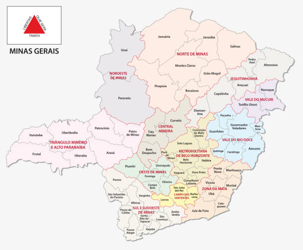

# 📊 Análise Estatística e Geográfica dos Municípios de Minas Gerais


## 📌 Descrição
Este projeto realiza uma Análise Exploratória de Dados (EDA) sobre os municípios do estado de Minas Gerais, Brasil. O objetivo principal é extrair insights relevantes sobre distribuição populacional, indicadores socioeconômicos e características geográficas, permitindo uma melhor compreensão das disparidades regionais e possíveis estratégias de desenvolvimento. O projeto também inclui um pré-processamento detalhado dos dados para facilitar sua utilização na Atividade 03 da disciplina de Data Science do programa ZL Academy.

## 🗺️ Mapa de Minas Gerais
Abaixo está um mapa ilustrando a divisão dos municípios no estado de Minas Gerais:



## 📂 Estrutura do Projeto
- **Coleta de Dados**: Importação dos dados brutos a partir de fontes confiáveis.
- **Exploração Inicial**: Análise da estrutura do dataset e verificação de valores ausentes.
- **Análise Estatística**: Geração de estatísticas descritivas e distribuição dos dados.
- **Visualização de Dados**: Gráficos para melhor compreensão das disparidades regionais.
- **Pré-Processamento**: Limpeza e transformação dos dados para garantir consistência.
- **Exportação**: Salvamento do dataset tratado para uso posterior.

## 📊 Principais Insights

Algumas análises realizadas incluem:
- **Distribuição do PIB per capita**: Identifica disparidades econômicas entre os municípios.
- **Mortalidade Infantil**: Evidencia diferenças significativas entre as regiões.
- **Escolarização**: Percentual de crianças matriculadas por município.
- **Receitas e Despesas Municipais**: Avalia a sustentabilidade financeira das cidades.


## 🚀 Como Executar o Projeto

### 📥 1. Clonar o Repositório
```bash
git clone https://github.com/seu-usuario/analise-mg-municipios.git
cd analise-mg-municipios
```

### 📦 2. Criar e Ativar um Ambiente Virtual (Opcional, mas Recomendado)
```bash
python -m venv venv  # Criar ambiente virtual
source venv/bin/activate  # Linux/Mac
.\venv\Scripts\activate  # Windows (CMD)
```

### 📌 3. Instalar Dependências
```bash
pip install -r requirements.txt
```

### 📂 4. Executar o Notebook
- Você pode usar o VSCode para rodar o Notebook, garantindo que está utilizando o ambiente virtual que criamos.
- Alternativamente, execute o comando `jupyter notebook` no terminal, certificando-se de estar localizado no diretório da aplicação e com o ambiente virtual ativo.
- Após isso, carregue e execute o arquivo `analise_mg_municipios.ipynb` com uma das opções acima.

## 📑 Dicionário de Dados
| Coluna | Descrição |
|--------|------------|
| `municipio` | Nome do município |
| `cod_municipio` | Código único de identificação do município |
| `gentilico` | Denominação dos habitantes |
| `prefeito_2021` | Nome do prefeito em 2021 |
| `area_territorial_km2` | Área territorial do município em km² |
| `populacao_residente` | Número estimado de habitantes |
| `densidade_demografica` | Habitantes por km² |
| `escolarizacao_6_14_anos` | Percentual de crianças e adolescentes matriculados |
| `IDHM` | Índice de Desenvolvimento Humano Municipal |
| `mortalidade_infantil` | Taxa de mortalidade infantil |
| `receitas_brutas` | Total de receitas arrecadadas |
| `despesas_brutas` | Total de despesas executadas |
| `PIB_per_capita` | Produto Interno Bruto per capita |


## 📚 Fonte dos Dados
- Instituto Brasileiro de Geografia e Estatística (IBGE): [Cidades e Estados - MG](https://www.ibge.gov.br/cidades-e-estados/mg.html)


## 🔧 Tecnologias Utilizadas
- **Python** (Pandas, NumPy, Matplotlib, Seaborn, Scikit-learn)
- **Jupyter Notebook** / **Google Colab**
- **Git e GitHub**


## 📬 Contato
Caso tenha dúvidas ou sugestões, fique à vontade para entrar em contato:
<br>
- **📧 E-mail**: ademar.castro.curriculo@gmail.com <br>
- **🔗 LinkedIn**: [Ademar Castro](https://www.linkedin.com/in/ademar-castro-8bb95b256/)

---

### ⭐ Se gostou do projeto, deixe uma estrela no repositório!